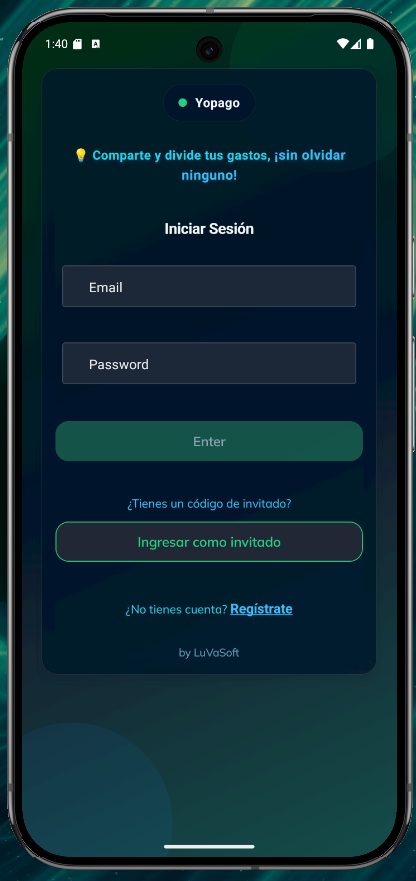
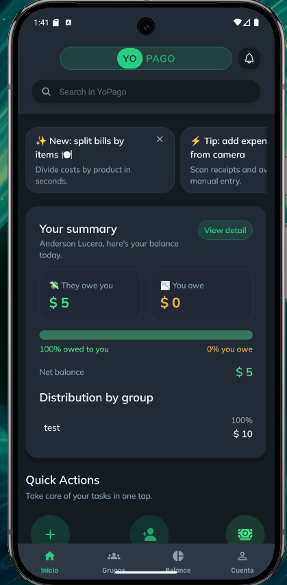
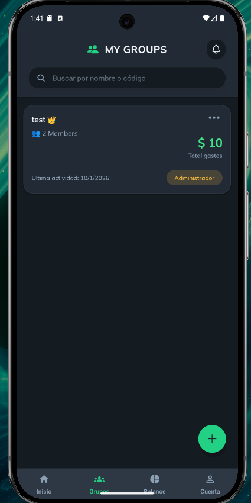
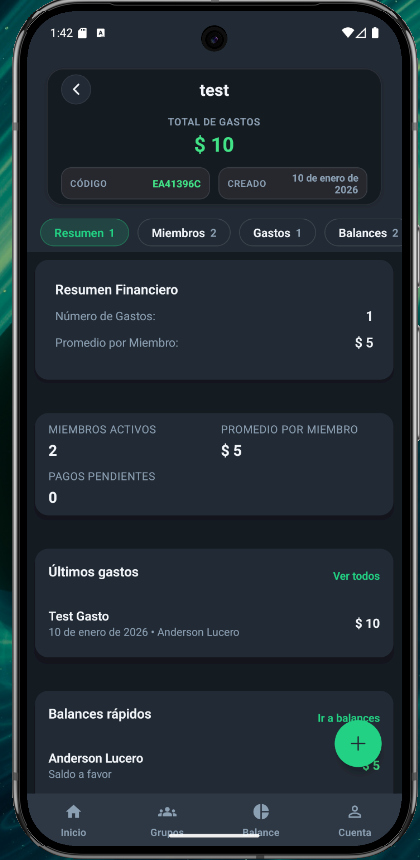
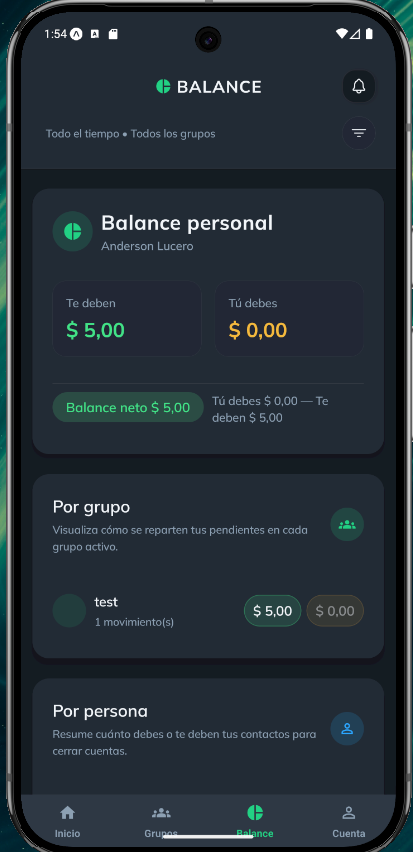

# 💸 YoPago --- Shared Expense Management Platform

[](https://opensource.org/licenses/Apache-2.0)
[](https://openjdk.org/projects/jdk/21/)
[](https://spring.io/projects/spring-boot)
[](https://expo.dev/)
[](https://www.postgresql.org/)
[](https://www.docker.com/)

> **YoPago** is a modern, cloud‑ready platform for managing and settling
> shared expenses.\
> It is designed for friends, roommates, trips, and collaborative groups
> that need to split costs fairly, transparently, and in real time.
>
> YoPago is a **personal open source project** built as a **DevOps and
> cloud architecture laboratory**.\
> Beyond being a functional product, it serves as a technical portfolio
> demonstrating end‑to‑end skills in: - containerized microservices, -
> identity & access management, - Kubernetes orchestration, -
> infrastructure as code, - automated pipelines, - secure configuration
> and secrets management.
>
> The project is **community‑friendly and collaborative**, welcoming
> contributions for learning, experimentation, and innovation.

------------------------------------------------------------------------

## ✨ Core Features

-   🏠 **Group Management** --- Create, invite, and manage groups for
    shared expenses\
-   💳 **Smart Expense Splitting** --- Automatic or custom cost
    distribution\
-   📸 **Receipt OCR** --- AI‑powered extraction using the `vision-ia`
    service\
-   👤 **Guest Participants** --- Add contributors without full
    accounts\
-   🔐 **Secure Authentication** --- OAuth2/OIDC via **Keycloak**\
-   📱 **Multi‑Platform UI** --- Mobile and web with **Expo / React
    Native**\
-   🌐 **Bilingual UI** --- Spanish + English\
-   🔗 **Shareable Invitations** --- Join via secure links

------------------------------------------------------------------------

## 📸 Screenshots

| Login | Home | My Groups |
|-------|------|-----------|
|  |  |  |

| Create Group | Balance | Account |
|-------------|---------|---------|
|  |  |  |

------------------------------------------------------------------------

## 🎯 Purpose of the Project


Deliver a practical, production‑style application that solves a real
everyday problem:\
**fair and transparent expense sharing.**

### 🛠️ Technical (DevOps) Goal

Use YoPago as a **hands‑on DevOps laboratory** covering:

-   **Containers:** Docker + Docker Compose\
-   **Local + Cloud Deployments**\
-   **Orchestration:** Kubernetes (manifests in `k8s/`)\
-   **Identity:** Keycloak (OAuth2/OIDC) in `keycloak/`\
-   **Microservices Architecture:** API + AI service\
-   **Infrastructure as Code:** Terraform in `terraform/`\
-   **Configuration Management:** ConfigMaps + Secrets\
-   **API Quality:** OpenAPI / Swagger documentation\
-   **Observability readiness:** structured logs and health endpoints

This dual focus makes YoPago both **useful software** and a **realistic
DevOps portfolio**.

------------------------------------------------------------------------

## 🏗️ High‑Level Architecture

    ┌─────────────────┐     ┌─────────────────┐     ┌─────────────────┐
    │   yopago-front  │────▶│  yopago (API)   │────▶│   PostgreSQL    │
    │  Expo/React     │     │  Spring Boot    │     │   Database      │
    │  Native         │     │  Java 21        │     │                 │
    └─────────────────┘     └────────┬────────┘     └─────────────────┘
                                     │
            ┌────────────────────────┼────────────────────────┐
            │                        │                        │
            ▼                        ▼                        ▼
    ┌─────────────────┐     ┌─────────────────┐     ┌─────────────────┐
    │    Keycloak     │     │   vision-ia     │     │    Kubernetes   │
    │  Identity       │     │  OCR / FastAPI  │     │   (optional)    │
    │  Provider       │     │  + OpenAI       │     │                 │
    └─────────────────┘     └─────────────────┘     └─────────────────┘

------------------------------------------------------------------------

## 📁 Repository Structure (aligned to your project)

    ├── docker-compose.yml      # 🐳 Local full-stack orchestration
    ├── .env.example            # Environment variables template
    ├── yopago/                 # ☕ Spring Boot API (Java 21)
    │   ├── src/
    │   └── Dockerfile
    ├── yopago-front/           # 📱 Expo + React Native app
    │   ├── app/
    │   └── Dockerfile
    ├── keycloak/               # 🔐 Keycloak realm + config
    │   └── Dockerfile
    ├── vision-ia/              # 🤖 OCR microservice (FastAPI)
    │   └── Dockerfile
    ├── bdd/                    # 🗄️ PostgreSQL scripts & seed data
    ├── k8s/                    # ☸️ Kubernetes manifests
    │   ├── backend.yaml
    │   ├── keycloak.yaml
    │   ├── vision-ia.yaml
    │   ├── configmap.yaml
    │   └── ingress.yaml
    └── terraform/              # 🏗️ Infrastructure as Code

------------------------------------------------------------------------

## 🚀 Quick Start (Local)

### Prerequisites

-   Docker Desktop (\>= 4.30) with Compose v2\
-   Git\
-   Node.js 18+ (optional)\
-   Java 21 (optional)\
-   OpenAI API Key (for `vision-ia`)

### 1) Clone

``` bash
git clone https://github.com/your-username/yopago.git
cd yopago
```

### 2) Configure environment

``` bash
cp .env.example .env
# edit values in .env
```

### 3) Run everything

``` bash
docker compose up --build -d
```

Stop services:

``` bash
docker compose down
```

### Local endpoints

  Service         URL                                     Description
  --------------- --------------------------------------- ---------------
  **Frontend**    http://localhost                        Web UI
  **API**         http://localhost:8080/api               REST backend
  **Swagger**     http://localhost:8080/swagger-ui.html   API docs
  **Keycloak**    http://localhost:8082                   Admin console
  **vision-ia**   http://localhost:8001                   OCR service

------------------------------------------------------------------------

## ☸️ Kubernetes (optional production)

Apply manifests:

``` bash
kubectl apply -f k8s/
```

You can replace images with your own registry (ACR, ECR, Docker Hub) and
configure Ingress accordingly.

------------------------------------------------------------------------

## 🧪 Development

### Backend

``` bash
cd yopago
./mvnw spring-boot:run
```

### Frontend

``` bash
cd yopago-front
npm install
npm run start
```

### Tests

``` bash
# backend
cd yopago && ./mvnw test

# frontend
cd yopago-front && npm test
```

------------------------------------------------------------------------

## 🔧 Tech Stack

  -----------------------------------------------------------------------
  Layer                   Technology
  ----------------------- -----------------------------------------------
  **Backend**             Java 21, Spring Boot 3.x, Spring Security,
                          JPA/Hibernate

  **Frontend**            React Native, Expo, TypeScript

  **Auth**                Keycloak (OAuth2/OIDC)

  **Database**            PostgreSQL 15

  **AI/OCR**              Python, FastAPI, OpenAI Vision

  **Containers**          Docker, Docker Compose

  **Orchestration**       Kubernetes

  **IaC**                 Terraform

  **CI/CD**               Azure Pipelines
  -----------------------------------------------------------------------

------------------------------------------------------------------------

## 🤝 Contributing

Contributions are welcome! See **CONTRIBUTING.md** for guidelines.

------------------------------------------------------------------------

## 📄 License

Apache License 2.0 --- see **LICENSE**.

------------------------------------------------------------------------

## 👨‍💻 Authors

**Anderson Lucero** --- DevOps & Cloud Engineer\
**Diego Vaca** --- DevOps & Cloud Engineer\
Open source portfolio project.

------------------------------------------------------------------------

## 🙏 Acknowledgments

-   Spring Boot\
-   Expo\
-   Keycloak\
-   OpenAI
