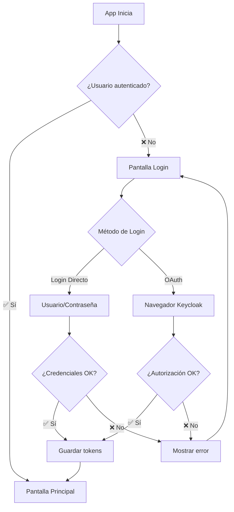

# 🔐 Guía Completa del Sistema de Login - Yopago

## 🎯 Resumen del Sistema Mejorado

Tu sistema de autenticación con Keycloak está ahora completamente optimizado con dos métodos de login:

1. **Login Directo** (Usuario/Contraseña) - ⚡ Más rápido y fácil
2. **Login OAuth** (Navegador) - 🔒 Más seguro, con SSO

## 🚀 Características Principales

### ✅ **Pantalla de Login Mejorada**
- **Toggle entre métodos**: Cambia fácilmente entre login directo y OAuth
- **Credenciales de prueba**: Botones rápidos para llenar usuarios de test
- **Mejor UX**: Estados de carga, manejo de errores, validaciones
- **Responsive**: Se adapta al teclado automáticamente

### ✅ **Navegación Inteligente**
- **Redirección automática**: Login exitoso → Pantalla principal
- **Protección de rutas**: Solo usuarios autenticados acceden a la app
- **Estados de carga**: Indicador mientras verifica autenticación

### ✅ **Manejo Robusto de Errores**
- **Mensajes específicos**: "Usuario incorrecto", "Servidor no disponible", etc.
- **Limpieza de errores**: Botón X para quitar mensajes de error
- **Reintentos automáticos**: Refresh de tokens cuando expiran

## 🎮 Cómo Usar el Sistema

### 1. **Inicio de la App**
```
App se abre → Verifica si hay sesión activa
├── ✅ Hay sesión → Directo a pantalla principal  
└── ❌ No hay sesión → Pantalla de login
```

### 2. **Login Directo** (Recomendado para desarrollo)
1. **Abrir la app** → Aparece pantalla de login
2. **Activar "Login Directo"** (toggle ya está activado por defecto)
3. **Usar botones de prueba**:
   - **Botón "Admin"** → Llena: `admin` / `admin123`
   - **Botón "Usuario"** → Llena: `testuser` / `password123`
4. **Presionar "Iniciar Sesión"**
5. **Éxito** → Alert de bienvenida → Pantalla principal

### 3. **Login OAuth** (Para producción)
1. **Desactivar "Login Directo"** (toggle)
2. **Presionar "Iniciar Sesión con Keycloak"**
3. **Se abre navegador** → Login en Keycloak
4. **Autorizar app** → Regresa a la aplicación
5. **Éxito** → Pantalla principal

## 🔧 Configuración Requerida

### **Keycloak debe estar corriendo en:**
```
http://localhost:8082
```

### **Realm configurado:**
```
Realm: yopago
Cliente: yopago-mobile
```

### **Usuarios de prueba en Keycloak:**
```
Usuario: admin
Contraseña: admin123
Roles: admin, user

Usuario: testuser  
Contraseña: password123
Roles: user
```

## 📱 Componentes del Sistema

### **1. AuthContext** - `contexts/AuthContext.tsx`
```tsx
const { 
  user,              // Usuario actual
  isAuthenticated,   // ¿Está logueado?
  isLoading,         // ¿Cargando?
  error,             // Mensaje de error
  login,             // Login OAuth
  loginDirect,       // Login directo
  logout,            // Cerrar sesión
  clearError         // Limpiar errores
} = useAuth();
```

### **2. Pantalla de Login** - `app/(auth)/login.tsx`
- **Toggle** para cambiar método de login
- **Formulario** con validaciones
- **Botones de prueba** para llenar credenciales
- **Manejo de estados** (loading, errores)

### **3. Layout Inteligente** - `app/_layout.tsx`
- **Navegación condicional** basada en autenticación
- **Loading screen** durante verificación inicial
- **Rutas protegidas** automáticamente

## 🎯 Flujo de Autenticación



## 🛠️ Para Desarrolladores

### **Usar en tu componente:**
```tsx
import { useAuth } from '@/contexts/AuthContext';

function MiComponente() {
  const { user, isAuthenticated, logout } = useAuth();
  
  if (!isAuthenticated) {
    return <Text>Debes estar logueado</Text>;
  }
  
  return (
    <View>
      <Text>¡Hola {user?.firstName}!</Text>
      <Button title="Cerrar Sesión" onPress={logout} />
    </View>
  );
}
```

### **Llamadas autenticadas al API:**
```tsx
import { useAuthenticatedApiService } from '@/services/authenticatedApiService';

function MiComponente() {
  const apiService = useAuthenticatedApiService();
  
  const cargarDatos = async () => {
    try {
      // El token se incluye automáticamente
      const grupos = await apiService.getUserGroups();
      console.log(grupos);
    } catch (error) {
      console.error('Error:', error);
    }
  };
}
```

### **Proteger rutas específicas:**
```tsx
import { ProtectedRoute } from '@/components/auth/ProtectedRoute';

export default function PantallaAdmin() {
  return (
    <ProtectedRoute requiredRoles={['admin']}>
      <MiContenidoDeAdmin />
    </ProtectedRoute>
  );
}
```

## 🚨 Solución de Problemas

### **Error: "No se puede conectar"**
- ✅ Verificar que Keycloak esté corriendo en `localhost:8082`
- ✅ Revisar configuración en `services/config.ts`

### **Error: "Usuario o contraseña incorrectos"**
- ✅ Verificar usuarios en Keycloak Admin Console
- ✅ Usar botones de prueba en lugar de escribir manual

### **Error: "Token expirado"**
- ✅ El sistema renueva automáticamente
- ✅ Si persiste, hacer logout/login

### **OAuth no funciona**
- ✅ Verificar redirect URI en Keycloak: `yopago://auth`
- ✅ Verificar deep linking en `services/linkingConfig.ts`

### **App no redirige después del login**
- ✅ Error solucionado en la nueva implementación
- ✅ Usar `router.replace("/")`

## 🎉 ¡Todo Listo!

Tu sistema de autenticación está completamente funcional con:

- ✅ **Dos métodos de login** (directo y OAuth)
- ✅ **UX mejorada** (loading, errores, validaciones)
- ✅ **Navegación automática** (rutas protegidas)
- ✅ **Manejo robusto de errores**
- ✅ **Credenciales de prueba** integradas
- ✅ **Renovación automática** de tokens
- ✅ **Deep linking** para OAuth

**Para probar:**
1. Abrir la app
2. Usar botón "Admin" o "Usuario"
3. Presionar "Iniciar Sesión"
4. ¡Disfrutar de tu app! 🚀

---

**💡 Tip:** Usa **Login Directo** durante desarrollo para agilizar las pruebas, y **OAuth** en producción para mayor seguridad.

## 📞 Soporte

Si tienes problemas:
1. Revisa los logs en la consola
2. Verifica que Keycloak esté corriendo
3. Usa las credenciales de prueba exactas
4. Reinicia la app si es necesario

¡Happy coding! 🎯